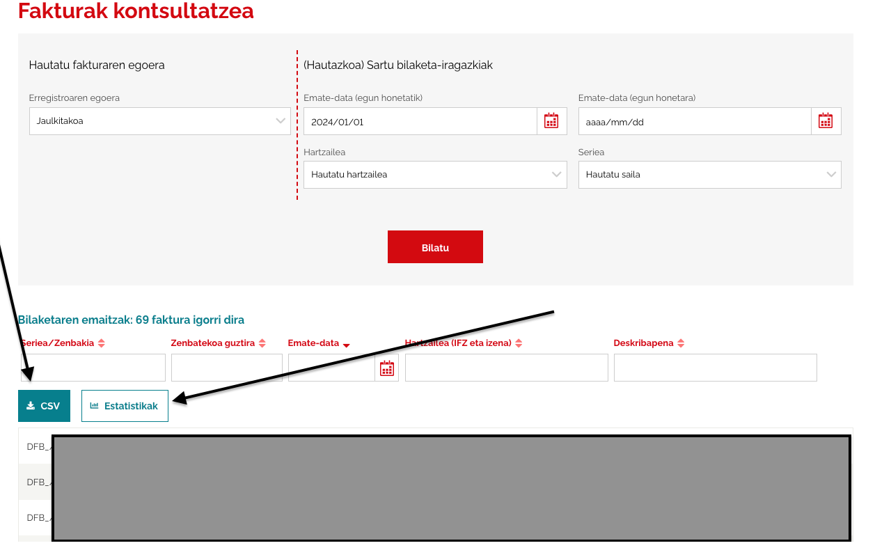
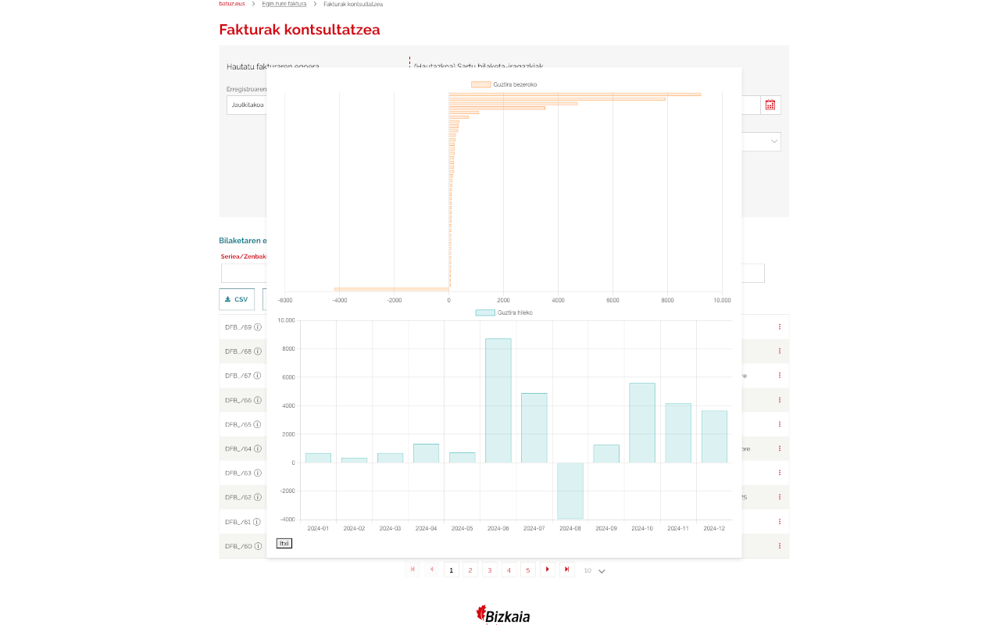

# Batuz +
### Chrome hedapena

Hedapen edo gehigarri honek [Batuz](https://batuz.eus/) webgunean funtzionalitate berriak gehitzeko eginda dago.
Oraigoz kontzeptu froga bat da.
Bi botoi gehizen ditu igorritako faktura zerrendatren gainean:

* **CSV** botoia: faktura zerrenda CSV formatuan deskargatzeko.
* **Estatisitikak** botoia: Bi grafika erakusten ditu, bata hilez hile fakturaturiko kopuruarekin eta beztea bezeroaren arabera.

## Instalazio Instrukzioak

1. **Kodea jaistea**  
   - Joan GitHub errepositoriora eta bilatu eskuineko aldean dagoen [**"Download ZIP"**](https://github.com/ZhenIT/batuz_plus/archive/refs/heads/master.zip) botoia.  
   - Jaitsi `.zip` fitxategia eta atera/deskargatu zure ordenagailuko karpeta batean.

2. **Chrome hedapena kargatzea**  
   - Ireki Chrome eta joan menura (hiru puntuko ikonoa). Ondoren, sakatu **"More tools"** -> **"Extensions"**.  
   - Eskumako goialdean dagoen **"Developer mode"** botoia aktibatu.  
   - Sakatu **"Load unpacked extension…"** botoia.

3. **Hedapena hautatzea**  
   - Agertuko den fitxategi-leihoan joan deskonprimitu duzun karpetara.  
   - Hautatu manifest.json fitxategia duen karpeta. (Adibidez, *batuz-chrome-extension-master/ext* karpeta).  
   - Hori egin ostean, hedapena automatikoki kargatuko da.

4. **Erabiltzen hastea**  
   - Batuz webgunea bisitatzean, hedapenak gehitutako funtzionalitate berriak nabarituko dituzu.  

Hori da dena! hedapenak behar bezala funtzionatzen duela egiaztatzeko, nabigatzailea berrabiarazi dezakezu edo Batuz orria freskatu.

## Laguntza eta ekarpenak

Arazoren bat baldin baduzu edo hobekuntzak proposatu nahi badituzu, mesedez ireki [**Issue**](https://github.com/ZhenIT/batuz_plus/issues) bat errepositorioan edo bidali [**Pull Request**](https://github.com/ZhenIT/batuz_plus/pulls) bat. Pozik hartuko ditugu zure ekarpenak!

Eskerrik asko Batuz Chrome hedapena erabiltzeagatik!